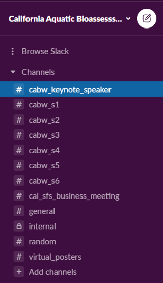

```{r setup, include=FALSE}
knitr::opts_chunk$set(echo = TRUE)
```

:::obj

  **Slack Guide**

 - What is Slack
 - Why we are using it
 - How to Join!

:::

<br>

## `r icon::fa("slack")` What is Slack?

Slack is an online communication platform where users can join chat messaging rooms that are organized by topic. Since we are hosting a virtual meeting this year, the interactions we usually have during in-person events (e.g. chatting in the halls, or during a poster session), unfortunately, will not happen. Slack will allow us to replicate these types of interactions, to the extent we can, in the virtual world. 

**We are using it because...**

 - By using Slack, everyone will be able to engage with one another, including the presenters, during and after the presentations. We also plan to gather questions from the attendees during the presentation Q&A’s.
 
 - All of us will be able to post questions, responses, and other resources (e.g. links, photos, documents) to all others to see.
 
 - Slack is FREE to join and use!

<br>

## `r icon::fa("sign-in-alt")` How to Join Slack `

We encourage all those interested in engaging through Slack to join in advance of the meeting, if possible. 

 1.	If you do not have a Slack account, you can create one for free by following these instructions on how to **[Get Started with Slack](https://slack.com/help/articles/218080037-Getting-started-for-new-members)**.

 2.	Once you have a Slack account, you will need to join our workspace: **California Aquatic Bioassessment Workgroup**

 3.	You can join via the **[Workspace to your account manually](https://slack.com/help/articles/212675257-Join-a-Slack-workspace)** or
 4. **[Select this link](https://join.slack.com/t/californiaaqu-nb73845/shared_invite/zt-gnwt2dqs-49CtyuGvZQmChA1nDmqwNQ)** to be invited to join

<br>

### **A couple things to note:**


 - Slack only works using the desktop app or when using Google Chrome or Firefox
 
 - If you already have a slack account, we recommend logging in and searching for the workspace: **California Aquatic Bioassessment Workgroup** rather than clicking the invitation link above. 
 

<br>

## `r icon::fa("user-friends")` Engage! 

Once you have entered the workspace, you should automatically have all channels added on the left-hand purple bar. Below is just an example of what you might see when you join the workspace (*channel names may be updated*):
<br>

```{r slackimg, echo=FALSE, out.height="100%"}



```

<br>

### Channels

 - There is a Channel for each session: located on the left of the screen prefaced by a hashtag `#`
 - On the Agenda, and at the beginning of each presentation, we will direct you to the correct Channel that is dedicated to hold conversations pertaining to that presentation.
 - If you would like to engage, ask questions, or view resources dedicated to a presentation, you will select the appropriate Channel and the conversation in that channel will appear
 - If you want to add something to the conversation type your question, thought, or response in the box at the bottom of the screen. Be sure to hit the green send button on the right to send your text into the channel. For more guidance on this, check out Slack’s [Send and read messages](https://slack.com/help/articles/201457107-Send-and-read-messages) guidance.
 - If you would like to attach something to your message, click the paperclip icon next to the send button to add your attachment. For more guidance on this, check out Slack’s [Add files to Slack](https://slack.com/help/articles/201330736-Add-files-to-Slack) guidance.

<br>

### Just want to submit a question?

If you cannot get Slack to work but still have a question you would like to ask presenters, please send them to <a href="mailto:Shuka.Rastegarpour@waterboards.ca.gov">Shuka Rastegarpour</a>

<br>

## `r icon::fa("info-circle")` Slack Resources 

If you are new to Slack and want some additional help using the platform, we recommend you check out:

 - The [Using Slack](https://slack.com/help/categories/200111606) help page

 - Check out some of the [Slack Tutorials](https://slack.com/resources/using-slack/slack-tutorials)

